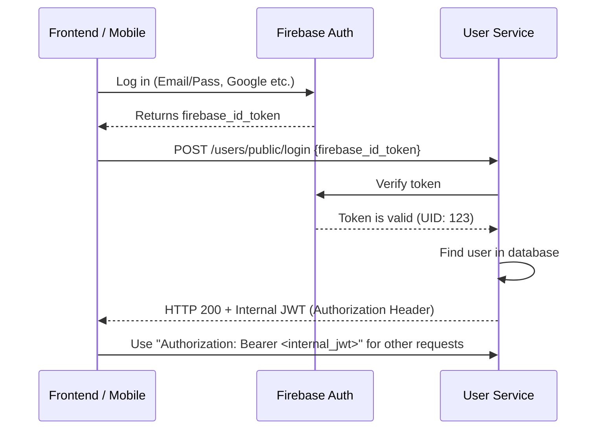

# Sniffas User Service

This service is a microservice of the Sniffas platform that manages user management, authorization, and address information. It provides a secure authentication flow with Firebase Auth integration.

## 🚀 What Does the Project Do?

The system allows users to log in via Firebase and then manages API access by generating its own internal JWT token. User profiles, addresses, company information, and seller applications are managed through this service.

### Authentication Flow (Auth Flow)

The system uses both a Firebase ID Token and its own internal JWT mechanism. The flow is as follows:



---

## 🛠 Quick Start

Follow the steps below to run the project in your local environment.

### Requirements
- Java 11
- Maven
- Docker (for Database and RabbitMQ)

### 1. Start Infrastructure (Docker)
You can use the `docker-compose.yml` file in the project to quickly start MySQL and RabbitMQ:

```bash
docker-compose up -d
```

### 2. Configuration
You need to set the Firebase service account key (`FIREBASE_TOKEN`) in the `src/main/resources/application.properties` file. This value is the content of the `.json` file downloaded from Firebase.

```bash
export FIREBASE_TOKEN='{ "type": "service_account", ... }'
```

### 3. Run the Application

If you don't have Java 11 installed, you can use Docker Deployment
```bash
./mvnw clean install
./mvnw spring-boot:run
```

You can access the Swagger documentation at [http://localhost:8080/documentation](http://localhost:8080/documentation).

---

## 🛣 Important Endpoint List

Check Swagger for the full API list. Here are the most critical ones:

### Public Endpoints
No JWT is required for these endpoints.

| Method | Path | Description |
| :--- | :--- | :--- |
| `POST` | `/users/public/login` | Logs in with Firebase ID Token. Returns Internal JWT in `Authorization` header. |
| `POST` | `/users/public/register` | Creates a new user registration. |
| `GET` | `/users/public/availableUsernames` | Queries the availability of a username. |

### Private Endpoints
The `Authorization: Bearer <internal_jwt>` header is mandatory for these endpoints.

| Method | Path | Description |
| :--- | :--- | :--- |
| `GET` | `/users/{userId}` | Gets user details. |
| `PUT` | `/users/{userId}` | Updates user information. |
| `DELETE` | `/users/{userId}` | Deletes the user account. |
| `POST` | `/users/{userId}/addresses` | Adds a new address to the user. |
| `POST` | `/users/{userId}/seller-requests` | Submits a request to become a seller. |

---

## 🐳 Docker Deployment
If you want to dockerize the project:

```bash
docker build -t sniffas-user-service .
docker run -p 8080:8080 sniffas-user-service
```
